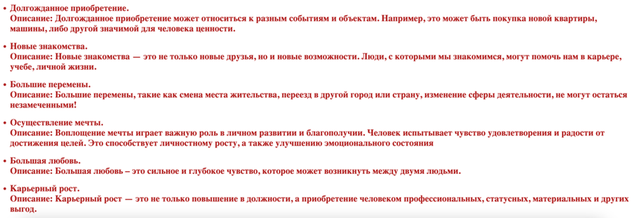
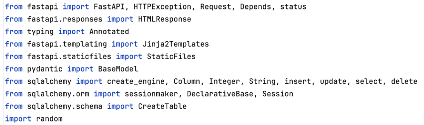
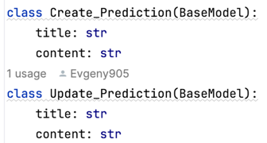

# Дипломная работа по курсу "Python-разработчик"
# Тема: Анализ и сравнение написания web-приложений с использованием разных фреймворков

## Цель и задачи дипломной работы
*Цель*  
* Обоснование выбора фреймворка для разработки веб-приложений на Python на основе их сравнительного анализа.  

*Задачи*
1. Изучить работу фреймворков Django, Flask и FastAPI; 
2. Разработать аналогичные простые веб-приложения на каждом из фреймворков; 
3. Провести сравнение фреймворков Django, Flask и FastAPI.
## Обзор фреймворков
*Django* – это веб-фреймворк с полным стеком с открытым исходным кодом, написанный на Python, который следует архитектурному шаблону MTV (модель-шаблон-представление) и принципу DRY (не повторяйтесь). Оно было сделано Адрианом Головати и Саймоном Уиллисоном и было публично опубликовано в 2005 году. Данное название основано на имени певца Джанго Рейнхардта.  

*Flask* – это удобный для начинающих веб-фреймворк с открытым исходным кодом, написанный на Python, который поддерживает шаблоны Jinja, которые можно использовать для создания представлений. Оно было сделано Армином Ронахером из Pocoo, международной группы энтузиастов Python, созданной в 2004 году. Название "Flask" является отсылкой к более раннему фреймворку Bottle.  

*FastAPI* также является микро-веб-фреймворком Starlette-ASGI (Asynchronous Server Gateway Interface) с открытым исходным кодом, написанным на Python и используемым для создания RESTful API. Оно было сделано Себастьяном Рамиресом в декабре 2018 года. Название основано на скорости разработки API, отсюда и "FastAPI". 
## Обзор и структура проекта
В связи с наступающим Новым 2025 Годом хочется создать праздничное настроение, для этого выполнено веб-приложение в новогодней тематике.  

Главной задачей веб-приложения является выбор предсказания на 2025 год. Для реализации данной задачи потребуется модуль random для генерации псевдослучайных чисел, которые определяют порядковый номер в перечне пожеланий. Предварительно в базу данных добавляется таблица с пожелания, включающая в себя две позиции – заголовок (title) и описание (content).  

Проект включает в себя следующие ключевые компоненты: главная страница, страница с выбором предсказания, страница с выбранным предсказанием и страница с перечнем всех предсказаний.
## Главная страница
На главной странице в верхней части отображается меню со ссылками на все страницы сайта. В нижней части приведена информация «Вы находитесь на главной странице».

## Страница с выбором предсказания
При нажатии на ссылку «Узнать предсказание на 2025 года» открывается страница с выбором предсказания. В нижней части данной страницы есть кнопка «Узнать предсказание». На данной странице также в верхней части отображается меню со ссылками на все страницы сайта.

## Страница с выбранным предсказанием
При нажатии на кнопку «Узнать предсказание» в базе данных рандомно выбирается предсказание, которое открывается на новой странице с выбранным предсказанием – в нижней части выводятся заголовок (title) и описание (content).

## Страница с перечнем всех предсказаний
В разработанном веб-приложении также можно ознакомиться с полным перечнем всех предсказаний, которые сохранены в базу данных. При нажатии на ссылку «Просмотр всех предсказаний» открывается новая страница, в нижней части которой выводятся заголовок (title) и описание (content) всех предсказаний. На данной странице также в верхней части отображается меню со ссылками на все страницы сайта.

## Шаблоны страниц
  
*menu.html* - базовый шаблон, на его основании пишутся остальные. Данный шаблон используется только в фреймворке Django.  
*main_page.html* – главная страница.  
*predictions.html* – страница с выбором предсказания.  
*prediction.html* – страница с выбранным предсказанием. Данный шаблон принимает предсказание с ключем «Prediction» и выводит его заголовок (title) и описание (content).  
*viewing.html* – страница с перечнем всех предсказаний. Данный шаблон принимает предсказания с ключем «Predictions», перебирает их с помощью цикла for и выводит заголовок (title) и описание (content) каждого предсказания.
## Написание веб-приложения на фреймворке Django
Сначала нужно установить Django, для этого в консоли PyCharm нужно прописать команду «pip install django». Далее нужно создать наш проект, в консоли PyCharm прописываем команду «django-admin startproject NewYear» (где NewYear – наименование проекта) – появляется папка с несколькими файлами.  
  
После этого необходимо создать приложение в проекте с помощью команды «python manage.py startapp predictions» (где predictions – наименование приложения). После выполнения команды будет создана директория с приложением predictions, в которой находятся инструменты для настройки отображения страниц и взаимодействия с базой данных.  
  
Далее к проекту необходимо подключить и само приложение в файле «settings.py», иначе при запуске сервера будет ошибка.  
  
Также в файле «settings.py» для взаимодействия с отображениями страниц необходимо спуститься в TEMPLATES и в параметре «DIRS» прописать нашу папку с шаблонами: [BASE_DIR / 'templates'] 
  
Чтобы настроить отображение страниц на сайте, необходимо использовать файл «views.py», расположенный в директории приложения. В нем пишутся функции, в которых настраивается логика взаимодействия с сервером.  
  
Для создания моделей необходимо пользоваться файлом «models.py», расположенный в директории приложения predictions. В данном файле прописывается класс по создаванию таблицы «Prediction» со столбцами заголовок (title) и описание (content).  
Чтобы настроить взаимодействие с базой данных, для начала нужно выполнить команды «python manage.py makemigrations» для проверки несохранённых связей таблиц и «python manage.py migrate» для сохранения этих связей. Данные команды необходимо использовать каждый раз при добавлении новых моделей (таблиц) в приложение.  
  
После этого мы создаем суперпользователя (для админки), выполнив команду «python manage.py createsuperuser» и в файле admin.py регистрируем модель, чтобы потом с помощью администратора добавлять нужные нам предсказания, где будут указаны их заголовки (title) и описания (content).  
  
Далее переходим в файл «urls.py», расположенный в директории проекта NewYear, и прописываем в нем все пути, которые мы хотим сделать с помощью path.  
  
Чтобы запустить проект осталось прописать в консоли команду «python manage.py runserver».  
Переходим по ссылке «http://127.0.0.1:8000» на главную страницу нашего сайта. Для добавления в базу данных предсказаний переходим по адресу «http://127.0.0.1:8000/admin/» и в разделе «Predictions» нажимаем кнопку "Add" и заполняем нужные нам параметры.  
  
## Написание веб-приложения на фреймворке FastAPI
Сначала нужно установить FastAPI, для этого в консоли PyCharm нужно прописать команду «pip install fastapi».  
Дополнительно устанавливаем библиотеки Pydantic (для создания класса базовых моделей) и SQLAlchemy (для работы с базой данных): «pip install pydantic», «pip install sqlallchemy».  
Для взаимодействия с отображениями страниц в директории «templates» с шаблонами создаем новые одноименные шаблоны, ранее используемые в Django, но уже без наследования от базового шаблона menu.html. Данные манипуляции связаны с тем, что наследование шаблонов поддерживается только в Django (что безусловно является его преимуществом), для фреймворков Flask и FastAPI каждый шаблон создается независимо друг от друга (наследование не поддерживается).  
  
Далее для реализации проекта в файле «main.py» создаем наше приложение «app», подключаем статические файлы с указанием директории «static», а также роутер. В папке backend подключаем новую базу данных «Predictions_base.db». Стоит отметить, что ранее созданная база данных «db.sqlite3» в Django фреймворками FastAPI и Flask не поддерживается.  

  
После этого в пакете «models» создаём описание структуры базы данных для работы с ней (так называемая декларация схемы или таблица).  
  
В файле «schemas.py» с помощью библиотеки «Pydantic» создаем модели данных, которые проверяют входные данные на соответствие заданным типам и структуре   
  
Далее в пакете «routers» создаем роутер и прописываем шаблоны для работы с базой данных с использованием запросов POST (создание объекта), GET (просмотр объектов), PUT (изменение объектов) и DELETE (удаление объектов). При этом не забываем подключить наши шаблоны с указанием директории «templates» с помощью Jinja2Templates.  

  

  
Также прописываем шаблоны для настройки проекта и отображения их на сайте.  
  
Для работы с базой данных необходимо дополнительно установить библиотеку alembic – прописываем в консоли команду «pip install alembic». В появившемся файле настроек «alembic.ini» указываем нашу базу данных: sqlalchemy.url = sqlite:///Predictions_base.db. После этого выполняем миграцию, прописав в консоли команды «alembic upgrade head» и «alembic revision --autogenerate -m "Initial migration"».  
Чтобы запустить проект осталось прописать в консоли команду «python -m uvicorn main:app» (где main – наименование нашего модуля с приложением app).  
Переходим по ссылке «http://127.0.0.1:8000/docs#/» на интерактивную документацию API (Swagger).  
  
Для добавления в базу данных предсказаний в разделе «POST» заполняем нужные нам параметры и нажимаем кнопку "Execute".  
  
## Написание веб-приложения на фреймворке Flask
Сначала нужно установить Flask, для этого в консоли PyCharm нужно прописать команду «pip install flask».  
Далее для реализации проекта создаем пакет «Flask», в котором выстраиваем структуру аналогично ранее созданному пакету «FastAPI». Импортируем необходимые библиотеки, создаем наше приложение «app», загружаем конфигурацию по умолчанию и переопределяем в конфигурации часть значений через переменную окружения. При этом указываем базу данных «Predictions_base.db», ранее созданную в фреймворке FastAPI.  

  
Для соединения с базой данных прописываем функцию «connect_db». Для проверки соединения с базой данных создаем функцию «get_db».  

Чтобы настроить отображение страниц на сайте, прописываем функции, в которых настраивается логика взаимодействия с сервером. Чтобы запустить проект прописываем команду «app.run()».  

  
## Сравнение фреймворков Django, Flask и FastAPI 
Разработка на **Django** подразумевает очень строгие требования к иерархии и архитектуре проекта, но за счёт этого разработчик меньше задумывается о подключении тех или иных приложений к проекту, настройки связи с базой данных, а также меньше беспокоится о защите. Благодаря строгости в архитектуре, большинство моментов по связи отдельных компонентов программы берёт на себя сам фреймворк. Если понять, как именно должны располагаться файлы, то разработка на Django становится не сложной и понятной. Минусом же Django является его же плюс: новичку будет достаточно сложно разобраться в том, как правильно взаимодействовать с файлами фреймворка.  
Django использует ORM (Object-Relational Mapping) для работы с базами данных. Это упрощает процесс взаимодействия с базой данных и позволяет сосредоточиться на логике приложения. Сам ORM предоставляет абстракцию над базой данных, позволяя разработчикам работать с объектами Python вместо SQL-запросов.  
Django предлагает мощные механизмы для работы с шаблонами и представлениями, что позволяет создавать динамические и интерактивные веб-страницы.  
Django поддерживает архитектуру MTV (Model-View-Templates), которая разделяет приложение на три компонента: модель, представление и контроллер. Это улучшает организацию кода и упрощает разработку.  

Разработка на **FastAPI** – очень простой и незамысловатый процесс, т.к. в отличии от Django фреймворк не накладывает строгих ограничений на архитектуру проекта, а также не имеет предустановленных инструментов для взаимодействия с базой данных и защиты. FastAPI – пустой холст для разработчика: на данном фреймворке разработчик сможет реализовать практически любую задумку именно так, как он хочет. Также, несомненным плюсом данного фреймворка является разработка посредством асинхронных функций, что делает его крайне быстрым. Ещё один немаловажный плюс – использование декораторов запросов. Данная особенность делает разработку отображений более систематизированной, понятной и удобочитаемой. Название отображает самое явное назначение этого фреймворка: он идеально подходит для разработки различных API вашего сервиса.
Главным минусом является отсутствие предустановленных библиотек для взаимодействия с базами данных и защиты данных (работ с формами). Эта особенность позволяет FastAPI быть менее требовательным к ресурсам сервера, но приводит к сложности со связью между компонентами. Несмотря на то, что уже давно выведен каноничный набор FastAPI, SQLAlchemy и Alembic, возникают сложности с миграциями и взаимодействием с базами данных.  

**Flask** является чем-то средним между Django и FastAPI. В данном фреймворке также предоставлен достаточно малый набор инструментов для разработки приложения. Но, также, как и FastAPI, это дает преимущество перед Django в плане ресурсоемкости. И также, как и FastAPI, Flask не предъявляет очень строгих требований к архитектуре проекта. Но в отличии от FastAPI, данный фреймворк имеет свои аналоги-дополнения популярным библиотекам для взаимодействия с базами данных и прочим. Также, в данном фреймворке по аналогии с FastAPI используются декораторы, что делает разработку систематизированной и удобной для восприятия.  

Сравнение фреймворков Django, FastAPI и Flask представлено в таблице.

Параметры | Django | FastAPI | Flask
 ------------ | ------------ |------| ------------- 
Год разработки | 2005 | 2018 | 2004 
Тип | Веб-фреймворк с полным стеком | Микро-веб-фреймворк | Микро-веб-фреймворк 
Пример использования | Создание сложных веб-приложений и API | Создание API и микросервисов | Идеально подходит для создания небольших веб-приложений и простых API
Производительность | Быстрый способ создания большого веб-приложения | Очень быстрый для создания API и микросервисов | Медленнее из-за ручной проверки и синхронизированного программирования
Масштабируемость | Масштабируемый, но его ORM и шаблонизатор могут замедлить масштабирование | Высокая масштабируемость, поскольку в нем используется асинхронизация кода и изменение типов | Сложно масштабировать, поскольку отсутствует встроенная поддержка ORM или кэширования
Кривая обучения | Сложный для начинающих | Простой для начинающих | Умеренный для начинающих
Инструменты для работы с базами данных | Полный набор | Ограничено, встроенной поддержки нет | Ограничено, встроенной поддержки нет
Асинхронное программирование | Да, это можно сделать с помощью Asyncio, но немного медленнее | Да, но быстрее благодаря Pydantic | Нет, но можем мы использовать другие библиотеки
ORM (Объектно-реляционное отображение) | ДА | НЕТ | НЕТ
Сообщество | Большой и активный | Небольшой, но растущий | Большой и активный
Документация | Огромный | Небольшой, но все еще растущий | Большой
Преимущества | Это отличный выбор для тех, кто хочет создавать безопасные, масштабируемые, гибкие и простые в обслуживании веб-приложения | Это отличный выбор для создания высокопроизводительных API и микросервисов | Это отличный выбор для создания веб-приложений малого и среднего уровня, где производительность не является большой проблемой и разработчикам требуется гибкость
Недостатки | Это может быть сложным для начинающих, сложным в отладке и не подходящим для небольших проектов | Основные файлы могут быть перегружены и отсутствует встроенная защита | Отсутствует встроенная поддержка кэширования, ORM, асинхронизации и т.д.

## Заключение
Таким образом, теперь мы можем сделать вывод, что FastAPI можно использовать из-за его высокой производительности при разработке API, Flask можно использовать для создания небольших и средних проектов с большой гибкостью, а Django - для создания многофункциональных крупномасштабных приложений.

## Приложение 1. Пример файловой структуры проекта
  
  
  

## Приложение 2. Список необходимых библиотек
* alembic==1.14.0
* annotated-types==0.7.0
* anyio==4.7.0
* asgiref==3.8.1
* blinker==1.9.0
* click==8.1.7
* distlib==0.3.9
* Django==5.1.4
* fastapi==0.115.6
* filelock==3.16.1
* Flask==3.1.0
* h11==0.14.0
* idna==3.10
* itsdangerous==2.2.0
* Jinja2==3.1.4
* Mako==1.3.8
* MarkupSafe==3.0.2
* platformdirs==4.3.6
* pydantic==2.10.3
* pydantic_core==2.27.1
* sniffio==1.3.1
* SQLAlchemy==2.0.36
* sqlparse==0.5.3
* starlette==0.41.3
* typing_extensions==4.12.2
* uvicorn==0.34.0
* virtualenv==20.28.0
* Werkzeug==3.1.3
